Tutorial
========

To illustrate the usage of the **Batch Calculator** we will calculate the the amounts
of reactants required to perform the synthesis of ZSM-22 described by Ernst et al. [1]_.

The batch composition is given as (p. 139 of [1]_):

- 13 K\ :sub:`2`\ O
- Al\ :sub:`2`\ O\ :sub:`3` 
- 91 SiO\ :sub:`2`
- 3670 H\ :sub:`2`\ 0
- 27 NH\ :sub:`2`\ (CH\ :sub:`2`\ )\ :sub:`6`\ NH\ :sub:`2` 

The reactants used are:

- silica sol (40% silica; Ludox AS40, DuPont) was
- Al\ :sub:`2`\ (SO\ :sub:`4`\ )\ :sub:`3`\ \* 18H\ :sub:`2` O
- KOH
- 1,6-diaminohexane (HMDA)
- water

The amounts of reactants used in the synthesis are presented in the
table below for reference

+------------+------------+
| Name       | Amoung [g] |
+============+============+
| KOH        |        7.8 |
+------------+------------+
| Al2(SO4)3  |        3.5 |
+------------+------------+
| silica sol |         72 |
+------------+------------+
| water      |        301 |
+------------+------------+
| HDMA       |       16.7 |
+------------+------------+

After starting the **Batch Calculator** the main window appears. As a first
step we need to add the components by clicking on the **Add/Remove** button
in the **Components** panel.

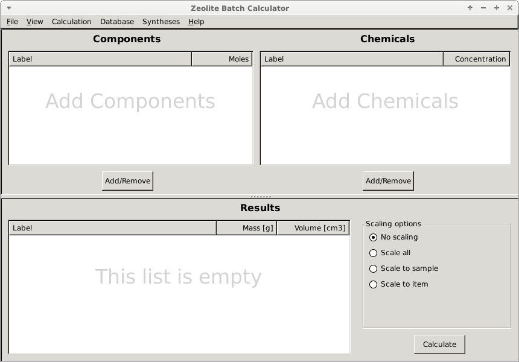

A dialog window should appear with all the components that are currently
available in the database. 

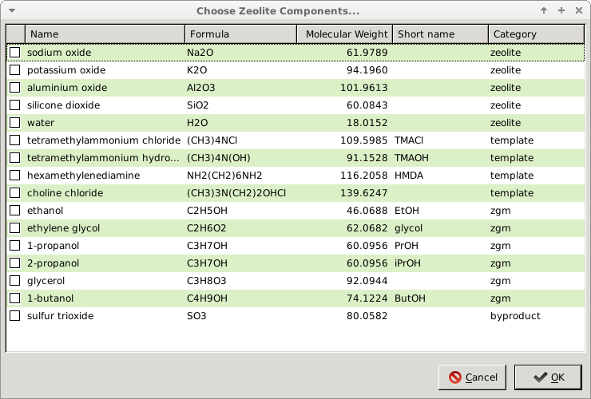

We need to choose the appropriate components by ticking the correct boxes
as shown below and click the **OK** button.

.. image:: img/tutorial/BC_004.png
    :width: 800px
    :align: center
    :alt: alternate text

By doing that the selected components are now shown in the main window
with the default amounts equal to 1.

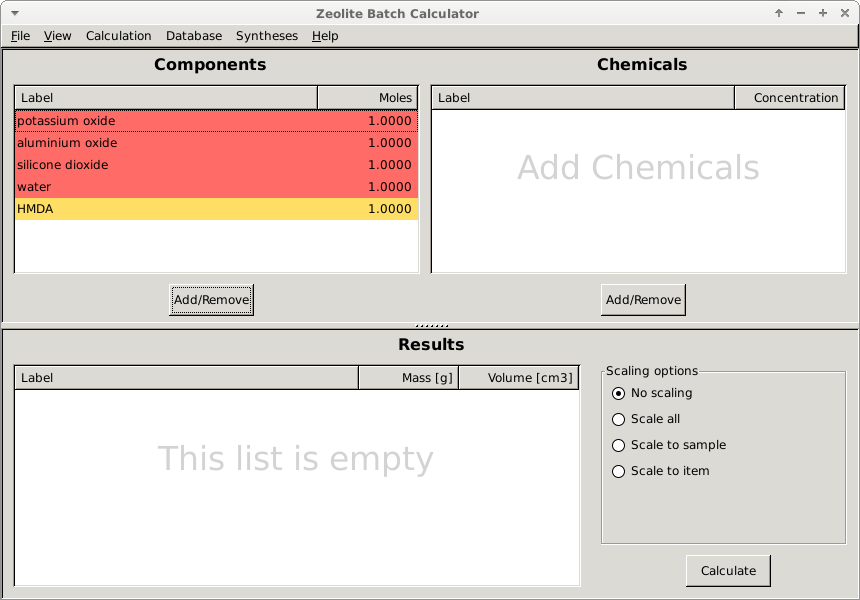

To adjust the amount double click on the appropriate number and enter
the correct amount, in our case the amounts are:

.. image:: img/tutorial/BC_007.png
    :width: 800px
    :align: center
    :alt: alternate text

Now we need to add the chemicals by clicking the **Add/Remove** button
in the **Chemicals** panel to open the dialog with all the chemicals
in the database that are potential sources for the selected components

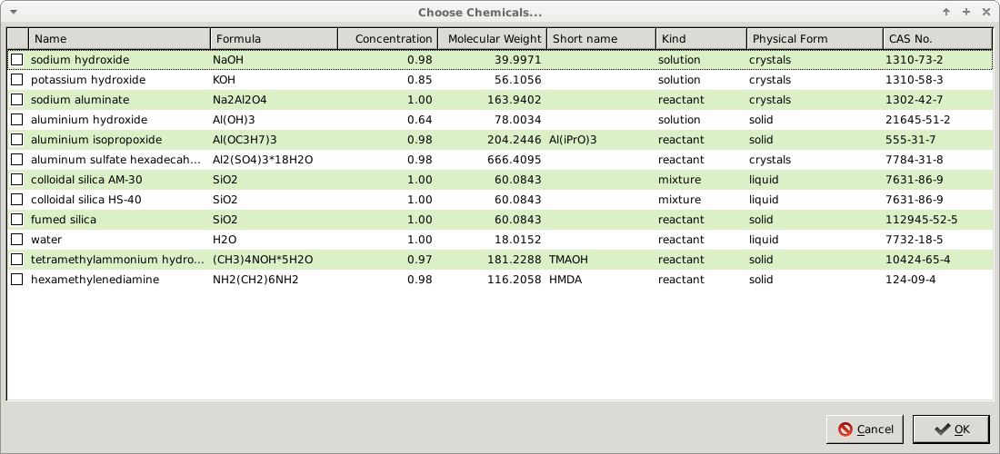

We can now select the appropriate chemicals by ticking the boxes in
the first column and click **OK**.

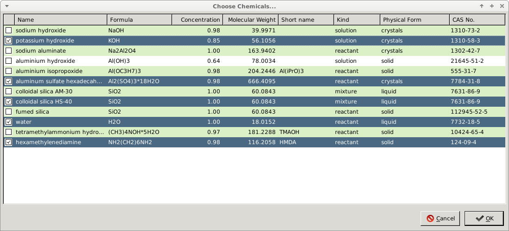

We can see that the chemical we successfully added to the main window
with their default concentration/purities depending on the kind of
chemical. The concentrations/purities can be adjusted in the same way
as the amounts of components by double clicking the fields and entering
the desired values.

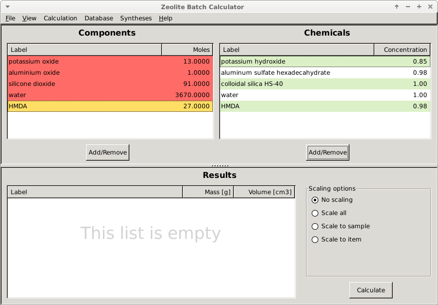

By clicking the **Calculate** button, the calculation will be performed
and the result will appear in the **Results** panel.

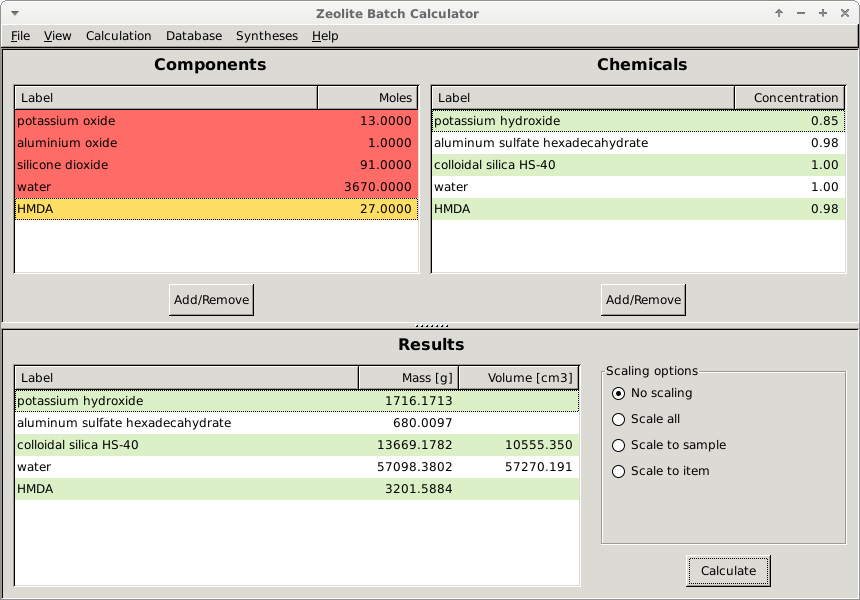

On the right hand side of the **Results** panel are the scaling options
to adjust the batch size. In order to compare our results to the ones
used in the paper we will rescale all the masses to the 16.7 g of HDMA
using the **Scale to item** option. 

.. image:: img/tutorial/BC_012.png
    :width: 800px
    :align: center
    :alt: alternate text

After selecting that option and clicking **Calculate** again a dialog will
appear where we will select **HMDA** and enter a value of **16.7** to scale
all the masses (and volumes) to 16.7 g of **HMDA** and click **OK**.

.. image:: img/tutorial/BC_013.png
    :width: 400px
    :align: center
    :alt: alternate text

The updated masses are now shown in the **Results** panel instead of the
initial results.

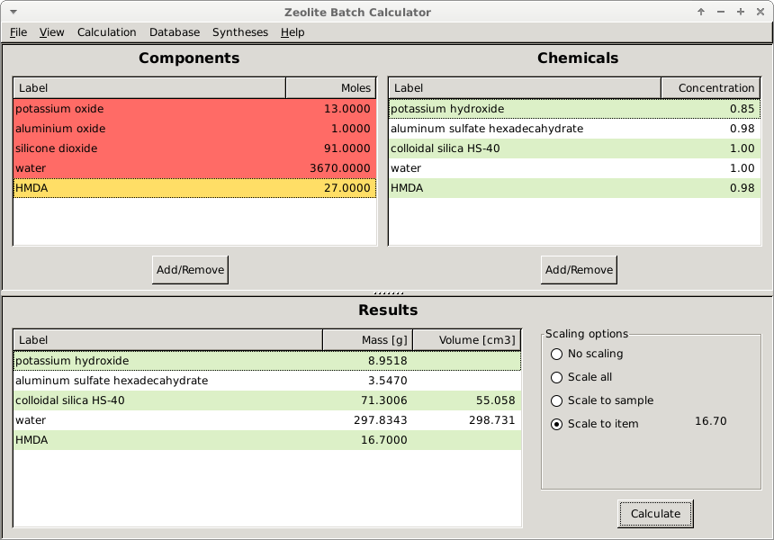

The result can be stored internally for further reference or modification
by clicking the **Add current** option from the **Syntheses** drop down menu

A dialog will be opened with an option to provide additional information
about the synthesis of the material

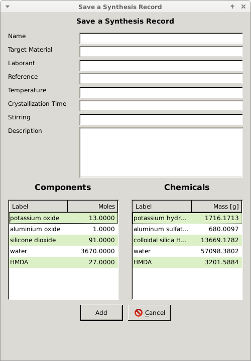

After filling in the form we can click the **Add** button that will store
the information in the internal database.

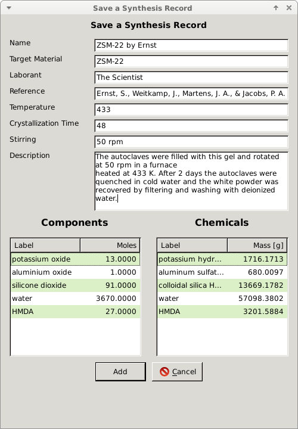

The dialog confirming the success of the modification should be displayed.

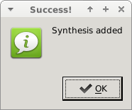

To verify or access the stored syntheses go to the **Syntheses** menu and
select **Show All** which will open up a dialog with the stored records.
From here the syntheses can be loaded back into the *Batch Calculator* deleted
or modified.

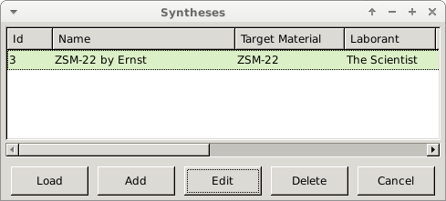

To finalize we can export a lab report for this synthesis by selecting the
**Export to pdf** option from the **File** menu

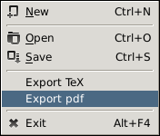

Another dialog appears with additional options for the report, where
also the sections of the report can be chosen

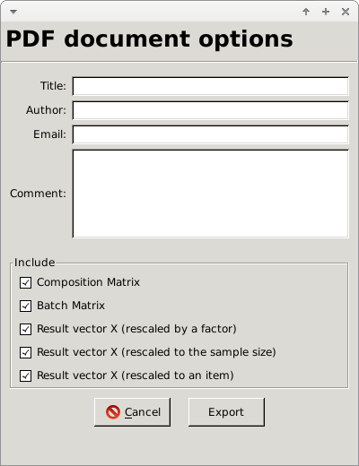

After filling out the details and clicking **Export**

.. image:: img/tutorial/BC_017.png
    :width: 400px
    :align: center
    :alt: alternate text

a dialog will appear to choose the file name and finally a message
should appear that the pdf was successfully generated.

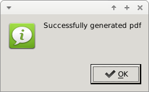

The report should like similar to the one below

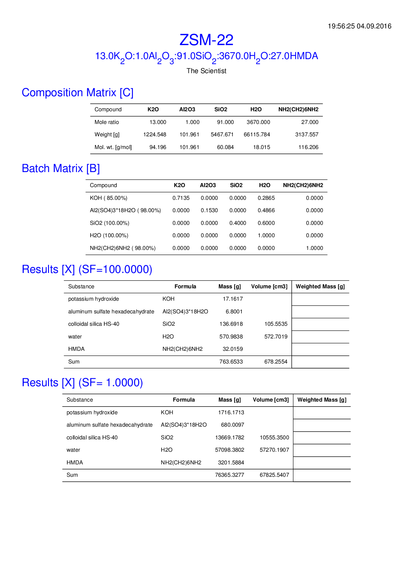

.. image:: img/tutorial/BC_report-1.png
    :width: 800px
    :align: center
    :alt: alternate text

.. [1] Ernst, S., Weitkamp, J., Martens, J. A., & Jacobs, P. A. (1989).
   Synthesis and shape-selective properties of ZSM-22.
   Applied Catalysis, 48(1), 137–148. 
   `doi:/10.1016/S0166-9834(00)80271-7 <http://doi.org/10.1016/S0166-9834(00)80271-7>`_